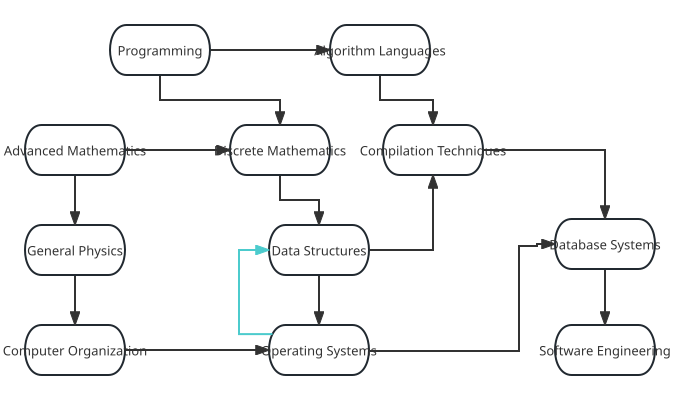

author: marscheng1

## Definition

Topological sorting solves the problem of ordering all vertices of a directed acyclic graph.

We can use the example of course scheduling in a university to describe this process. Among university courses, there are: "Programming", "Programming Language", "Calculus", "Discrete Mathematics", "Compiler Theory", "General Physics", "Data Structures", "Database Systems", etc. Following the scheduling example, when we want to learn "Data Structures", we must first learn "Discrete Mathematics". After completing this course, we have the prerequisite for learning "Compiler Theory". Of course, "Compiler Theory" has an even earlier prerequisite, "Programming Language". These courses are like vertices $u$, and directed edges $(u,v)$ between vertices represent the order in which courses must be taken. The academic office arranges these courses so that the logical relationships are satisfied—this is the process of topological sorting.



However, one day the scheduler dozed off and scheduled: to learn Data Structures, you must first learn Operating Systems, but the prerequisite for Operating Systems is Data Structures. So which one should you learn first (ignoring the possibility of taking them simultaneously)? Here, there is a cycle between Data Structures and Operating Systems. Clearly, students cannot figure out what to learn first, and topological sorting cannot be performed. If a directed graph contains a cycle, topological sorting is impossible.

Therefore, we can say that in a [DAG (Directed Acyclic Graph)](./dag.md), we arrange the vertices in a linear order such that for any directed edge $(u,v)$ from vertex $u$ to $v$, vertex $u$ comes before vertex $v$.

Also, given a DAG, if there is an edge from $i$ to $j$, then $j$ depends on $i$. If there is a path from $i$ to $j$ ($i$ can reach $j$), then $j$ indirectly depends on $i$.

The goal of topological sorting is to order all vertices such that vertices earlier in the order do not depend on vertices later in the order.

## AOV Network

In daily life, a large engineering project can be viewed as a set of subprojects. There must be a certain precedence relationship between these subprojects—some subprojects cannot start until others are completed.

We use a directed graph to represent the precedence relationships between subprojects. The edges represent these precedence relationships. This directed graph is called an Activity On Vertex Network, or **AOV Network**. An AOV network must be a directed acyclic graph, i.e., without cycles. Unlike DAGs, AOV activities are represented on vertices. (The example diagram above is an AOV network)

In an AOV network, vertices represent activities, and arcs represent precedence relationships between activities. An AOV network should not contain cycles. This way, we can find a sequence of vertices such that all prerequisite activities of each vertex appear before that vertex. This sequence is called a topological sequence (an AOV network may have multiple topological sequences). The process of constructing a topological sequence from an AOV network is called topological sorting. Therefore, topological sorting can also be described as arranging all activities of an AOV network into a sequence such that all prerequisite activities of each activity appear before that activity (the topological sort of an AOV network is also not unique).

-   Prerequisite activity: The activity at the start of a directed edge is called a prerequisite activity of the activity at the end of the edge (an activity can only start after all its prerequisite activities are completed).

-   Follow-up activity: The activity at the end of a directed edge is called a follow-up activity of the activity at the start of the edge.

A method to detect cycles in an AOV network is to construct a topological sequence and check if it contains all vertices.

### Steps to Construct a Topological Sequence

1.  Select a vertex with in-degree zero.
2.  Output this vertex and delete it along with all its outgoing edges.

Repeat the above two steps until all vertices are output (topological sorting is complete), or there is no vertex with in-degree zero. In the latter case, the graph has a cycle and topological sorting cannot be completed—this is a deadlock.

## Critical Path and AOE Network

The counterpart of AOV network is **AOE Network (Activity On Edge Network)**, where edges represent activities. An AOE network is a weighted directed acyclic graph, where vertices represent events and edges represent the duration of activities. Typically, AOE networks are used to estimate the completion time of a project. An AOE network should be acyclic and have a unique source vertex with in-degree zero and a unique sink vertex with out-degree zero.


In an AOE network, some activities can be performed in parallel. Therefore, the shortest time to complete the entire project is the length of the longest activity path from the start to the end (the path length here refers to the sum of durations of all activities on the path, i.e., the sum of edge weights, not the number of edges). Since a project needs all activities within it to be completed, the longest activity path is the critical path, which determines the total project completion time.

### Basic Concepts of AOE Networks

-   Activity: In an AOE network, edges represent activities. The weight of an edge represents the activity's duration. An activity starts after its source event (the start vertex of that edge) is triggered.

-   Event: In an AOE network, vertices represent events. An event is triggered after all its prerequisite activities (edges pointing to that vertex) are completed.

-   Earliest occurrence time of event (vertex) $v_i$: The earliest possible time the event can occur, denoted $ve(i)$. This determines the earliest start time of activities starting from this vertex. Clearly, the source vertex's earliest occurrence time is 0. Since an event can only occur after all its prerequisite activities are completed, it equals the maximum path length from the source to that vertex. In recurrence form: $ve(i) = \max\{ve(j) + val^j_i ~\vert~ j \in pre_i\}$, where $val^j_i$ is the weight of the edge from $j$ to $i$ (the duration of the activity from $j$ to $i$), and $pre_i$ is the set of all prerequisite events of $i$.

-   Latest occurrence time of event (vertex) $v_i$: The latest time the event can occur without delaying the entire project, denoted $vl(i)$. This determines the latest start time of all activities ending at this state. It equals the minimum of the latest start times of all follow-up activities: $vl(i) = \min\{vl(j) - val^i_j ~\vert~ j \in nxt_i\}$, where $val^i_j$ is the weight of the edge from $i$ to $j$ (the duration of the activity from $i$ to $j$), and $nxt_i$ is the set of all follow-up events of $i$.

-   Earliest start time of activity (edge) $(u, v)$: The earliest possible start time of the activity, denoted $e(u,v)$. Clearly, it equals the earliest occurrence time of its source event: $e(u,v)=ve(u)$.

-   Latest start time of activity (edge) $(u, v)$: The latest time the activity can start without delaying the entire project, denoted $l(u,v)$. It equals the latest occurrence time of its sink event minus the activity's duration: $l(u,v)=vl(v)-val^u_v$, where $val^u_v$ is the weight of the edge from $u$ to $v$ (the duration of the activity from $u$ to $v$).

-   Critical path: The length of the longest path from the source to the sink in an AOE network.

-   Critical activity: An activity on the critical path whose earliest start time equals its latest start time.

### Recurrence for Earliest and Latest Occurrence Times

Compute in topological order: earliest occurrence times are computed forward, latest occurrence times are computed backward. The recurrence formulas are as described in **Basic Concepts of AOE Networks**.

## Kahn's Algorithm

### Algorithm

Initially, set $S$ contains all vertices with in-degree zero, and $L$ is an empty list.

Each time, remove a vertex $u$ from $S$ (arbitrarily) and add it to $L$. Then delete all edges from $u$: $(u, v_1), (u, v_2), (u, v_3) \cdots$. For edge $(u, v)$, if after deleting this edge vertex $v$ has in-degree zero, add $v$ to $S$.

Repeat until set $S$ is empty. Check if any edges remain in the graph. If so, the graph must contain a cycle; otherwise, return $L$, which is the result of the topological sort.

First, let's look at the pseudocode from [Wikipedia](https://en.wikipedia.org/wiki/Topological_sorting#Kahn's_algorithm)

???+ note "Implementation"
    ```text
    L ← Empty list that will contain the sorted elements
    S ← Set of all nodes with no incoming edges
    while S is not empty do
        remove a node n from S
        insert n into L
        for each node m with an edge e from n to m do
            remove edge e from the graph
            if m has no other incoming edges then
                insert m into S
    if graph has edges then
        return error (graph has at least one cycle)
    else
        return L (a topologically sorted order)
    ```

The core of the algorithm is maintaining a set of vertices with in-degree zero.

See this diagram for reference:


The sorted result is: 2 -> 8 -> 0 -> 3 -> 7 -> 1 -> 5 -> 6 -> 9 -> 4 -> 11 -> 10 -> 12

### Time Complexity

Assuming the graph $G = (V, E)$, initializing set $S$ with vertices of in-degree zero requires traversing the entire graph and checking every edge, giving $O(E+V)$ complexity. Operations on this set also take $O(E+V)$ time.

Therefore, the total time complexity is $O(E+V)$.

### Implementation

=== "C++"
    ```cpp
    int n, m;
    vector<int> G[MAXN];
    int in[MAXN];  // Store in-degree of each node
    
    bool toposort() {
      vector<int> L;
      queue<int> S;
      for (int i = 1; i <= n; i++)
        if (in[i] == 0) S.push(i);
      while (!S.empty()) {
        int u = S.front();
        S.pop();
        L.push_back(u);
        for (auto v : G[u]) {
          if (--in[v] == 0) {
            S.push(v);
          }
        }
      }
      if (L.size() == n) {
        for (auto i : L) cout << i << ' ';
        return true;
      }
      return false;
    }
    ```

=== "Python"
    ```python
    from collections import defaultdict, deque
    
    
    def topo_sort(graph):
        lst = []
        in_degree = defaultdict(int)
        for u in graph:
            for v in graph[u]:
                in_degree[v] += 1
    
        s = deque([u for u in graph if in_degree[u] == 0])
        while s:
            u = s.popleft()
            lst.append(u)
            for v in graph.get(u, []):
                in_degree[v] -= 1
                if in_degree[v] == 0:
                    s.append(v)
    
        return None if any(in_degree.values()) else lst
    ```

## DFS Algorithm

### Implementation

=== "C++"
    ```cpp
    using Graph = vector<vector<int>>;  // Adjacency list
    
    struct TopoSort {
      enum class Status : uint8_t { to_visit, visiting, visited };
    
      const Graph& graph;
      const int n;
      vector<Status> status;
      vector<int> order;
      vector<int>::reverse_iterator it;
    
      TopoSort(const Graph& graph)
          : graph(graph),
            n(graph.size()),
            status(n, Status::to_visit),
            order(n),
            it(order.rbegin()) {}
    
      bool sort() {
        for (int i = 0; i < n; ++i) {
          if (status[i] == Status::to_visit && !dfs(i)) return false;
        }
        return true;
      }
    
      bool dfs(const int u) {
        status[u] = Status::visiting;
        for (const int v : graph[u]) {
          if (status[v] == Status::visiting) return false;
          if (status[v] == Status::to_visit && !dfs(v)) return false;
        }
        status[u] = Status::visited;
        *it++ = u;
        return true;
      }
    };
    ```

=== "Python"
    ```python
    from enum import Enum, auto
    
    
    class Status(Enum):
        to_visit = auto()
        visiting = auto()
        visited = auto()
    
    
    def topo_sort(graph: list[list[int]]) -> list[int] | None:
        n = len(graph)
        status = [Status.to_visit] * n
        order = []
    
        def dfs(u: int) -> bool:
            status[u] = Status.visiting
            for v in graph[u]:
                if status[v] == Status.visiting:
                    return False
                if status[v] == Status.to_visit and not dfs(v):
                    return False
            status[u] = Status.visited
            order.append(u)
            return True
    
        for i in range(n):
            if status[i] == Status.to_visit and not dfs(i):
                return None
    
        return order[::-1]
    ```

Time complexity: $O(E+V)$ Space complexity: $O(V)$

### Correctness Proof

Consider a graph. If after removing a vertex with in-degree zero, the new graph can be topologically sorted, then the original graph can also be topologically sorted. Conversely, if the original graph can be topologically sorted, then it can still be sorted after removal.

### Applications

Topological sorting can be used to detect cycles in a graph and to check if the graph forms a chain. Topological sorting can also be used to find the critical path in an AOE network and estimate the minimum completion time of a project.

### Finding Lexicographically Largest/Smallest Topological Sort

Replace the queue in Kahn's algorithm with a max-heap/min-heap priority queue. The total time complexity becomes $O(E+V \log{V})$.

## Practice Problems

[CF 1385E](https://codeforces.com/problemset/problem/1385/E): Requires constructing via topological sort.

[Luogu P1347](https://www.luogu.com.cn/problem/P1347): Topological sort template.

## References

1.  Discrete Mathematics and Its Applications. ISBN:9787111555391
2.  [Topological sorting - Wikipedia](https://en.wikipedia.org/wiki/Topological_sorting)
3.  [Data Structures Lecture 9 (Graph: Topological Sort, Critical Path, Shortest Path) - Zhihu Column](https://zhuanlan.zhihu.com/p/164751109)
